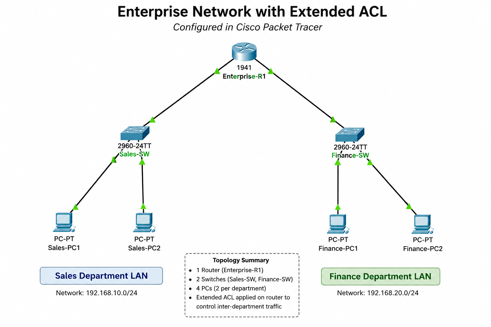

# Enterprise Network with Extended ACL


A Cisco Packet Tracer project demonstrating the design, configuration, implementation, and verification of an **Extended Access Control List (ACL)** in a small enterprise network.

---

## Project Overview

This project simulates a small enterprise network with two departments:

- Sales Department
- Finance Department

The objective was to configure an **Extended Access Control List (ACL)** to prevent the Sales department from accessing the Finance department while still allowing normal communication with each department's default gateway.

This project demonstrates basic enterprise networking concepts, IPv4 addressing, router configuration, ACL implementation, connectivity testing, and documentation.

---

## Objectives

- Design a small enterprise network
- Configure router interfaces
- Configure IPv4 addressing on end devices
- Verify connectivity before applying the ACL
- Configure an Extended ACL
- Verify blocked and permitted traffic
- Document the complete implementation process

---

## Professional Network Diagram



---

## Network Devices

| Device | Quantity |
|---|---:|
| Cisco 1941 Router | 1 |
| Cisco Catalyst 2960 Switch | 2 |
| PCs | 4 |

---

## IP Addressing

| Device | IP Address | Default Gateway |
|---|---|---|
| Sales-PC1 | 192.168.10.10 | 192.168.10.1 |
| Sales-PC2 | 192.168.10.11 | 192.168.10.1 |
| Finance-PC1 | 192.168.20.10 | 192.168.20.1 |
| Finance-PC2 | 192.168.20.11 | 192.168.20.1 |

---

## Project Walkthrough

### Step 1 – Devices Added and Renamed

All devices were added to Cisco Packet Tracer and renamed to clearly identify their roles within the network.


---

### Step 2 – Network Topology Cabled

The router, switches, and PCs were connected using Ethernet cables to build the network topology.


---

### Step 3 – Router Interface Configuration

Router interfaces were configured with IPv4 addresses and enabled using the `no shutdown` command.

The configuration was verified using:

```text
show ip interface brief
```


---

### Step 4 – Sales-PC1 IP Configuration

Sales-PC1 was configured with an IPv4 address, subnet mask, and default gateway.


---

### Step 5 – Finance-PC1 IP Configuration

Finance-PC1 was configured with an IPv4 address, subnet mask, and default gateway.


---

### Step 6 – Connectivity Test Before ACL

Before applying the ACL, Sales-PC1 was able to communicate with the Finance network using ICMP ping.

This verified that routing between departments was working before applying the security restriction.


---

### Step 7 – Extended ACL Configuration

An Extended Access Control List was configured on the router to deny ICMP traffic from the Sales network to the Finance network while permitting all other traffic.


---

### Step 8 – Sales to Finance Blocked by ACL

After applying the ACL, Sales-PC1 was no longer able to reach the Finance network.

This confirmed that the ACL was working as intended.


---

### Step 9 – Finance to Router Success

Finance-PC1 successfully communicated with its default gateway after the ACL was applied.

This confirmed that normal router connectivity remained available.


---

### Step 10 – Router ARP Table Verification

The router ARP table was checked to verify address resolution between IP addresses and MAC addresses.

```text
show arp
```


---

## Final Network Topology

The completed enterprise network after configuration, ACL implementation, and testing.


---

## Skills Demonstrated

- Cisco Packet Tracer
- Enterprise network design
- IPv4 addressing
- Router interface configuration
- Switch connectivity
- Ethernet cabling
- Default gateway configuration
- Extended Access Control Lists
- ICMP connectivity testing
- ARP verification
- Network troubleshooting
- Technical documentation

---

## What I Learned

Through this project, I practiced designing and configuring a small enterprise network from start to finish.

This lab helped me better understand how Extended ACLs can be used as a basic network security control to restrict traffic between departments while still allowing necessary communication with network infrastructure.

I also practiced verifying my configuration through ping tests, router interface checks, and ARP table verification.

---

## Future Improvements

Future improvements for this project could include:

- Configure VLANs
- Implement Inter-VLAN Routing
- Configure DHCP
- Add DNS and web servers
- Configure SSH for secure remote management
- Add NAT/PAT
- Add Internet connectivity
- Add more departments
- Implement basic network monitoring

---

## Files Included

| File | Description |
|---|---|
| `Enterprise-Network-with-Extended-ACL.pkt` | Cisco Packet Tracer project file |
| `images/` | Project screenshots and diagrams |
| `README.md` | Project documentation |

---

## Technologies Used

- Cisco Packet Tracer
- Cisco IOS
- IPv4
- ICMP
- ARP
- Extended Access Control Lists

---

## Author

**Karen Batres**  
Bachelor of Science in Cybersecurity and Information Assurance Student  
Western Governors University  

GitHub: https://github.com/KarenB1-tech
