# Enterprise Network with Extended ACL

Cisco Packet Tracer project demonstrating the design, configuration, and verification of an Extended Access Control List (ACL) in a small enterprise network.

---

## Project Overview

This project simulates a small enterprise network with two departments:

- Sales Department
- Finance Department

The goal of this project was to configure an **Extended Access Control List (ACL)** to prevent the Sales department from accessing the Finance department while still allowing normal router connectivity.

---

## Objectives

- Design a small enterprise network
- Configure router interfaces
- Configure PC IP addressing
- Verify connectivity before applying the ACL
- Configure an Extended ACL
- Test blocked and allowed traffic
- Document the full process with screenshots

---

## Network Topology

---

## Network Devices

| Device | Quantity |
|---|---:|
| Cisco 1941 Router | 1 |
| Cisco 2960 Switch | 2 |
| PCs | 4 |

---

## IP Addressing

| Device | IP Address | Default Gateway |
|---|---|---|
| Sales-PC1 | 192.168.10.10 | 192.168.10.1 |
| Sales-PC2 | 192.168.10.11 | 192.168.10.1 |
| Finance-PC1 | 192.168.20.10 | 192.168.20.1 |
| Finance-PC2 | 192.168.20.11 | 192.168.20.1 |

---

## Project Walkthrough

### Step 1 – Devices Added and Renamed

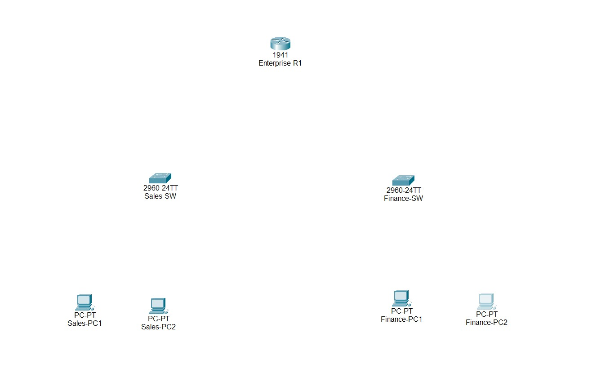

---

### Step 2 – Network Topology Cabled

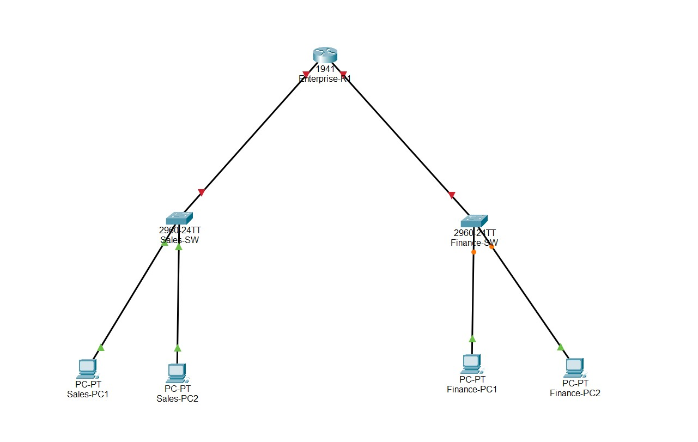

---

### Step 3 – Router Interface Configuration

The router interfaces were configured and verified using `show ip interface brief`.

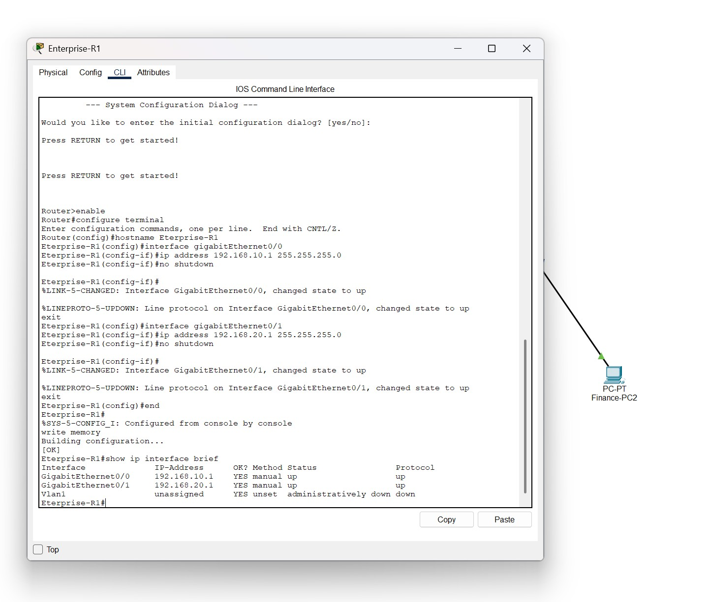

---

### Step 4 – Sales-PC1 IP Configuration

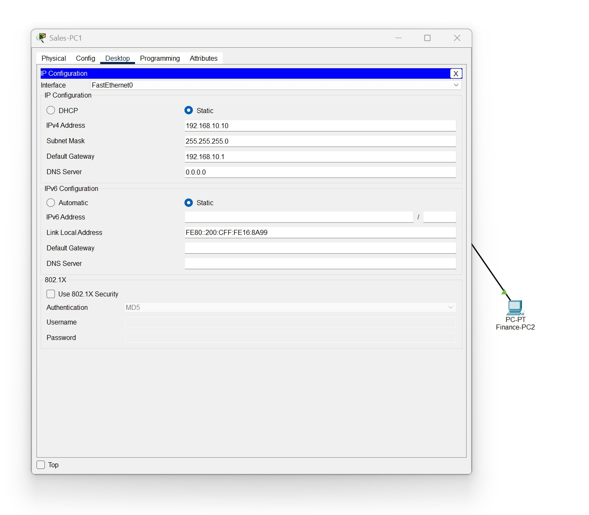

---

### Step 5 – Finance-PC1 IP Configuration

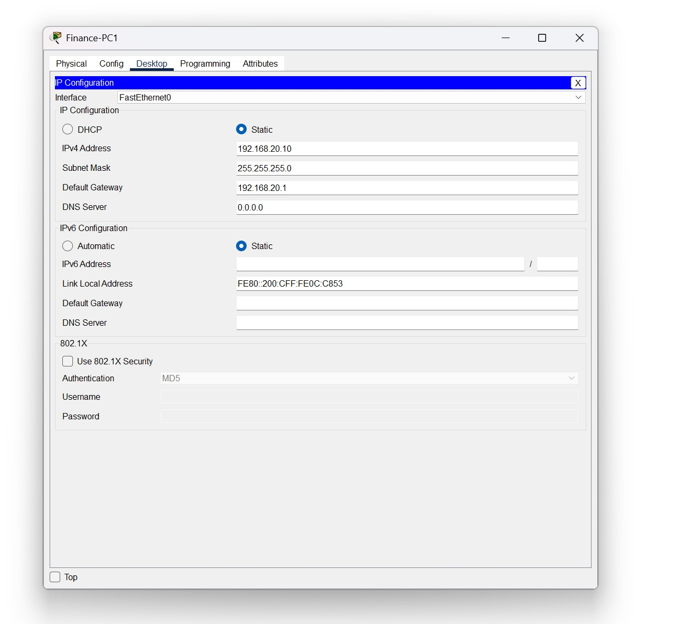

---

### Step 6 – Connectivity Test Before ACL

Before applying the ACL, Sales was able to communicate with Finance.

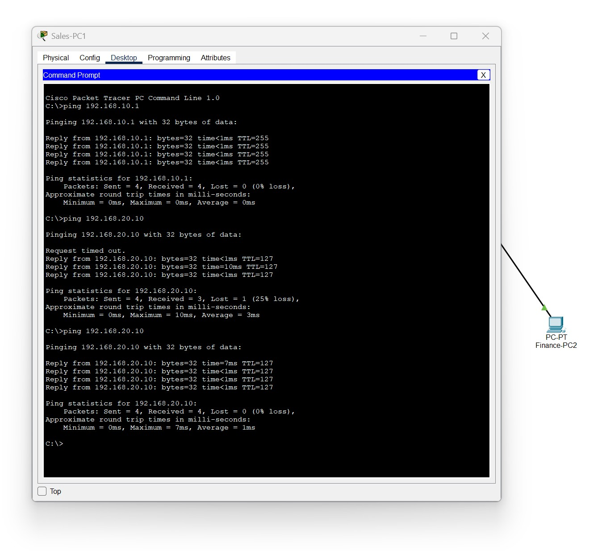

---

### Step 7 – Extended ACL Configuration

An Extended ACL was configured to block traffic from the Sales network to the Finance network.

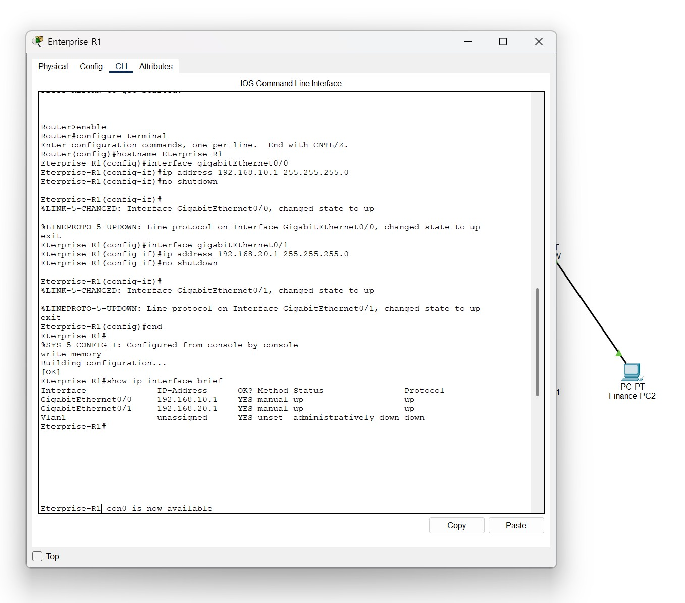

---

### Step 8 – Sales to Finance Blocked by ACL

After applying the ACL, Sales could no longer reach Finance.

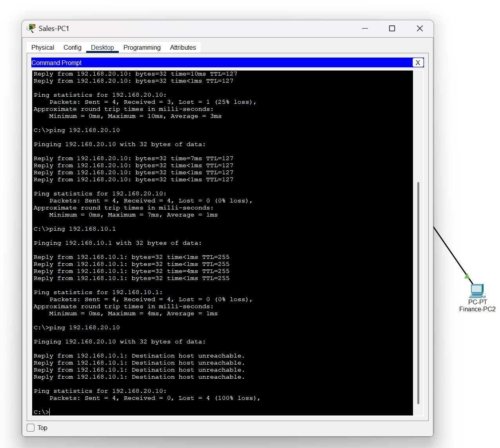

---

### Step 9 – Finance to Router Success

After applying the ACL, Finance was still able to communicate with its default gateway.

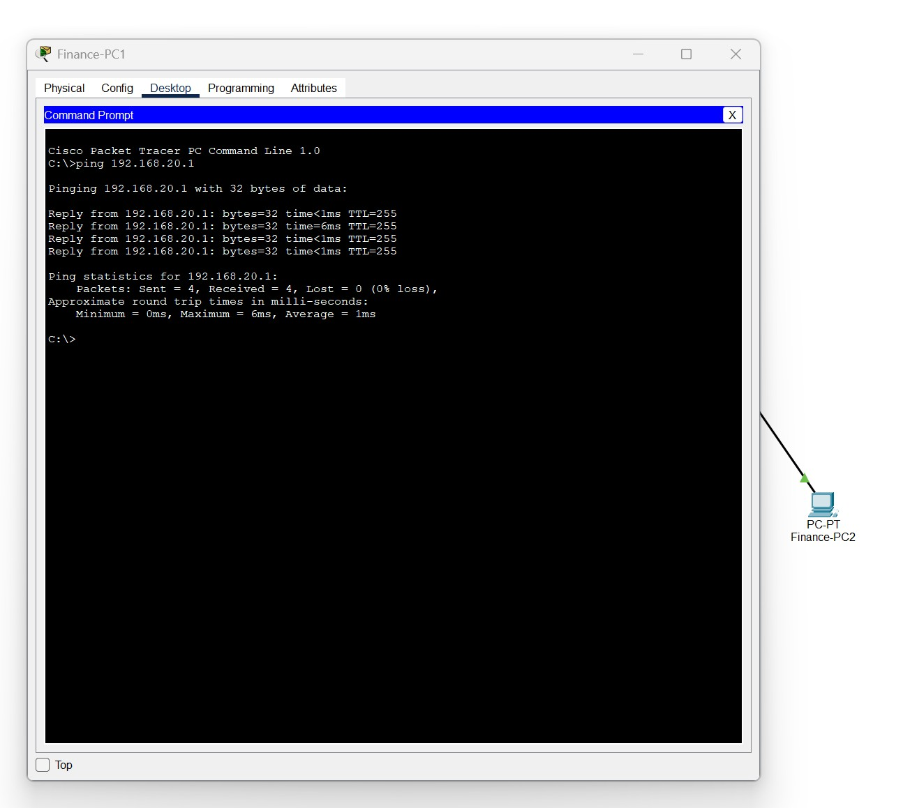

---

### Step 10 – Router ARP Table

The router ARP table was verified to confirm address resolution.

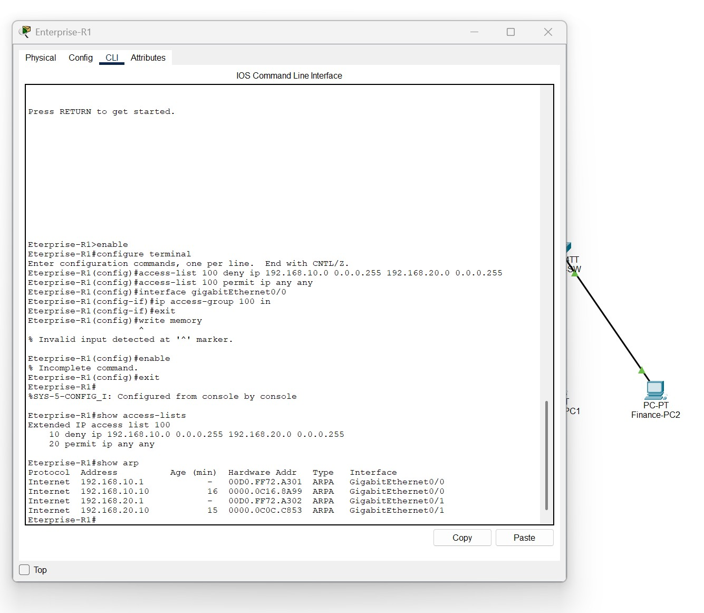

---

## Final Network Topology

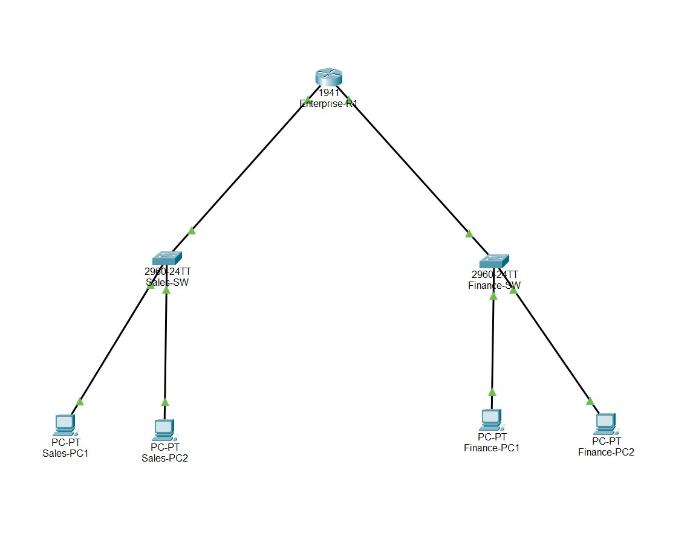

---

## Skills Demonstrated

- Cisco Packet Tracer
- IPv4 Addressing
- Router Interface Configuration
- Default Gateway Configuration
- Extended Access Control Lists
- ICMP Testing
- ARP Verification
- Network Troubleshooting
- Technical Documentation

---

## What I Learned

Through this project, I practiced building a small enterprise network, configuring router interfaces, assigning IP addresses to end devices, testing connectivity, and applying an Extended ACL to restrict traffic between departments.

This project helped me understand how ACLs can be used as a basic network security control.

---

## Future Improvements

- Add VLANs for each department
- Configure DHCP
- Add DNS and web servers
- Configure SSH for router management
- Add more departments
- Add Internet/NAT configuration

---

## Files Included

| File | Description |
|---|---|
| Enterprise-Network-with-Extended-ACL.pkt | Cisco Packet Tracer lab file |
| images/ | Screenshots and diagrams |
| README.md | Project documentation |

---

## Author

**Karen Batres**  
Cybersecurity and Information Assurance Student  
Western Governors University  

GitHub: https://github.com/KarenB1-tech
